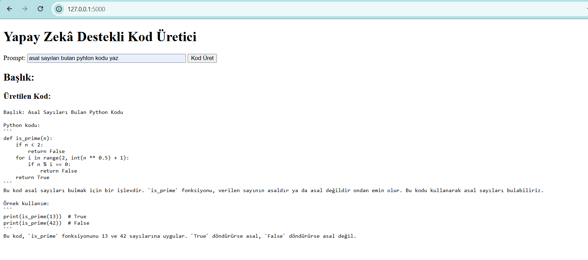

# AI-Powered Python Code Generator

Yapay zeka destekli Ollama LLM üzerinden çalışan basit bir Python kodu üretme uygulaması. Kullanıcılar, belirli bir prompt girerek, AI modelinden otomatik Python kodu ve başlık alır. Flask ile geliştirilmiş ve kullanılabilir bir web arayüzü ile sunulmaktadır.

## Ekran Görüntüleri


### 2. Kod Üretimi Ekranı
Kullanıcılar giriş yaptıktan sonra, yapay zeka destekli Python kodu üretme ekranına yönlendirilirler. Burada, bir prompt girerek yapay zekadan Python kodu ve başlık alabilirler.




## Proje İçeriği

Bu proje, Flask kullanarak basit bir web uygulaması geliştirmeyi amaçlamaktadır. Kullanıcılar, bir prompt (istek) girer ve yapay zeka modeli bu prompt’a göre Python kodu üretir. Üretilen kodun yanında, kısa ve anlamlı bir başlık da döndürülür.

### Kullanılan Teknolojiler:
- Python
- Flask (Web framework)
- Ollama (yerel yapay zeka modeli)
  
## Gereksinimler

- Python 3.x
- Flask
- Ollama (yerel yapay zeka modeli, isteğe bağlı)

## Kurulum Adımları

### 1. Depoyu Klonlayın
GitHub deposunu bilgisayarınıza klonlayın:

```bash
git clone https://github.com/username/ai-code-generator.git
cd ai-code-generator

2.ADIM => Depoyu Klonlayın Python ortamını izole etmek için sanal bir ortam oluşturun:

Windows:
python -m venv venv

Linux/macOS:
python3 -m venv venv

3.ADIM => Sanal ortamı etkinleştirdikten sonra, proje için gerekli olan Python kütüphanelerini yüklemek için şu komutu kullanın:

Windows:
.\venv\Scripts\activate
pip install -r requirements.txt

Linux/macOS:
source venv/bin/activate
pip install -r requirements.txt

4.ADIM =>  Flask Uygulamasını Çalıştırın

Flask uygulamasını başlatmak için aşağıdaki komutu kullanın:
python app.py

Uygulama başarıyla başlatıldığında terminalde şu satırı görmelisiniz:

Running on http://127.0.0.1:5000

Bunu tarayıcınızda açarak uygulamanın çalıştığını kontrol edebilirsiniz:
http://127.0.0.1:5000
